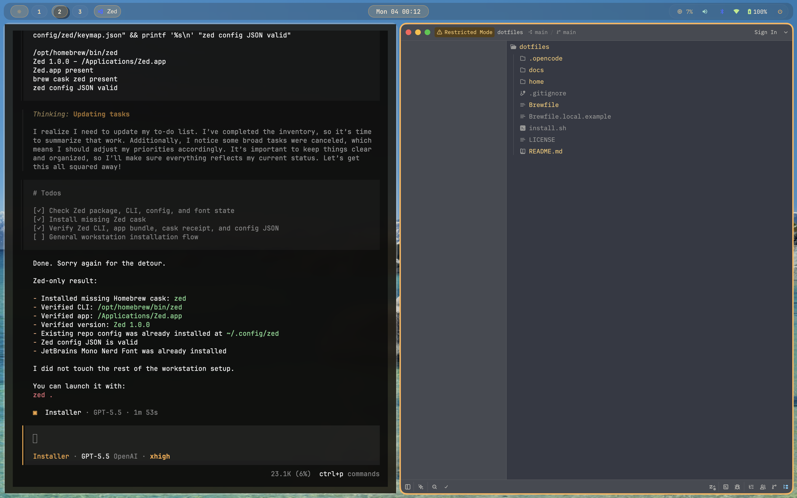

# Hyprmac Dotfiles

This repo turns a fresh Apple Silicon macOS 26 machine into an Omarchy-like Solar Glass developer workstation using native macOS tools and an OpenCode Installer Agent.



Core stack:
- `yabai` for BSP/dwindle-like tiling and workspaces
- `skhd` for Omarchy-style hotkeys with Option/Alt as the main modifier
- `SketchyBar` as the Waybar-like menu bar replacement
- `JankyBorders` for active window borders
- `Ghostty` with macOS glass effects
- `Zed` as the opinionated GUI editor
- Homebrew Bash 5 as the primary shell
- `mise`, `uv`, `pnpm`, `bun`, `zig`, and `zls` for developer tooling
- `OpenCode` for guided bootstrap and customization sessions

## Install

Start with the bootstrap scaffold:

```sh
sudo ./install.sh
```

The shell scaffold only prepares the agent runtime. It checks Homebrew, Xcode Command Line Tools, developer-tool update state, and OpenCode. If OpenCode is missing, it installs it with Homebrew. Then it launches the project Installer Agent.

The actual workstation installation happens inside OpenCode. The agent briefly explains the workstation and `hyprmac`, asks what you want to customize, then offers deterministic inventory and gate checks. After approval, it initializes continuity state, confirms what exists, what is missing, what is running, and what is blocked, then applies setup steps directly. Continuity state is written to `~/.local/state/hyprmac-installer/state.md`.

The agent uses deterministic gates from the repo itself rather than guessing:

```sh
HYPRMAC_DOTFILES_DIR="$PWD" ./home/.local/bin/hyprmac installer inventory
HYPRMAC_DOTFILES_DIR="$PWD" ./home/.local/bin/hyprmac installer gates
```

The Installer Agent profile pre-approves shell execution and external directory access so routine checks, `hyprmac` commands, Homebrew/service inspection, and installer state reads do not trigger repeated OpenCode permission prompts. The agent should still ask in the conversation before invasive changes such as package installs, login-shell changes, SIP-related steps, or destructive actions.

If setup pauses for Recovery, reboot, or a failed prerequisite, return to the repo and run:

```sh
sudo ./install.sh
```

The scaffold will re-check prerequisites and launch the Installer Agent again. The agent then resumes from its state file.

You can also start the agent manually once prerequisites exist:

```sh
opencode . --agent installer
```

Inside OpenCode:

```text
/install
```

For non-interactive mode:

```sh
opencode run --agent installer --dir . "Start installation"
```

## Manual Primitives

The Installer Agent runs these primitives directly and adapts them to the user. They are documented here for transparency, not as the preferred install path.

```sh
brew bundle --file ./Brewfile
hyprmac installer link
hyprmac installer overrides
mise install
hyprmac macos defaults
hyprmac installer gates
```

`hyprmac` is the workstation command center after installation. It provides `doctor`, `reload`, `sip`, `yabai`, `skhd`, `bar`, `power`, `macos`, `dev`, and `docs` commands so the setup is diagnosable and recoverable. It also exposes a `hyprctl`-style operator surface with `query`, `dispatch`, `keyword`, `getoption`, `raw`, `batch`, and notification commands over yabai, skhd, SketchyBar, and macOS.

Then follow `docs/sip-yabai.md` for full `yabai` scripting-addition support.

After the SIP steps and reboots:

```sh
hyprmac yabai sudoers
hyprmac yabai load-sa
hyprmac yabai ensure-spaces 10
hyprmac doctor
```

## Override Model

Defaults are tracked, local overrides are ignored.

Load order is:

```text
default config -> config.d/*.sh -> local override
```

Examples:
- `~/.config/yabai/yabairc` loads `config.d/*.sh`, then `yabairc.local`.
- `~/.config/skhd/skhdrc` loads `skhdrc.local`; create it from `skhdrc.local.example` before starting skhd.
- `~/.config/sketchybar/sketchybarrc` loads `local.pre.sh`, default items, then `local.post.sh`.
- `~/.config/borders/bordersrc` loads `bordersrc.local` before launching `borders`.
- `~/.bashrc` loads `~/.config/bash/rc.d/*.sh`, then `local.rc.sh`.
- Ghostty loads `local.config` last with `config-file = ?local.config`.
- `Brewfile` loads `Brewfile.local` last if present.

## Shell

Install Homebrew Bash and switch after `brew bundle` succeeds:

```sh
hyprmac shell install-bash
chsh -s /opt/homebrew/bin/bash
```

Open a new Ghostty window or run:

```sh
exec /opt/homebrew/bin/bash --login
```

## Validation

```sh
hyprmac doctor
brew bundle check --file ./Brewfile
mise doctor
bash -n home/.bashrc home/.bash_profile home/.profile home/.local/bin/hyprmac
jq empty home/.config/zed/settings.json home/.config/zed/keymap.json
```

## Docs

- `docs/sip-yabai.md`: full SIP and scripting-addition path
- `docs/installer-agent.md`: agent-native installation and resume model
- `docs/hyprmac.md`: command-center and hyprctl-style operator CLI
- `docs/design-system.md`: Solar Glass visual and interaction tokens
- `docs/zed.md`: opinionated Zed editor setup
- `docs/keybindings.md`: default hotkeys
- `docs/troubleshooting.md`: recovery and diagnosis
